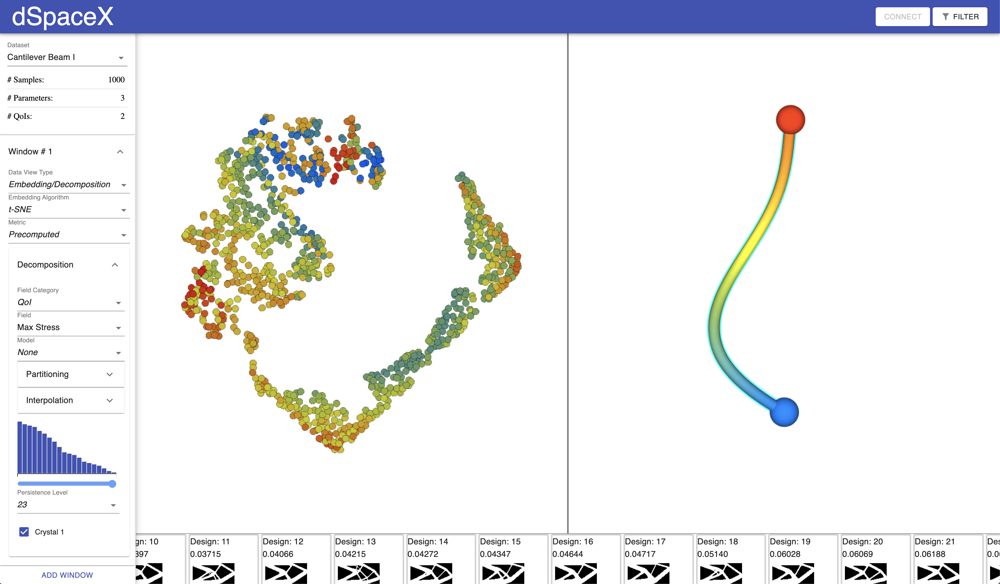

# dSpaceX - Design Space Exploration Tool

Exploration of multidimensional data using dSpaceX, the Design Space Explorer



Table of Contents
====================
- [Overview](#overview)  
- [Installation](#installation)  
- [Getting Started](#using-dspacex)  
- [Development](#development)  

## Overview
The Design Space Explorer facilitates decomposition, modeling, and deep exploration of multivariate datasets consisting of design parameters, quantities of interest, and shapes that represent these combinations. 


## Installation
Please see [Installing dSpaceX](documentation/INSTALL.md) to get things running.

## Using dSpaceX
The first step in using dSpaceX for exploration is to preprocess and load your datasets.  
Please see [dSpaceX Configuration](./documentation/configuration.md) to learn how to do this.  

Next, [start the server](documentation/server.md#running-the-server) and [open the web client](./client/README.md#running).  

Instructions for [Data Exploration using dSpaceX](documentation/using.md) can be found here.  

_Happy exploring!_

## Development
dSpaceX is under active development. To get started first build the server
**See [README.md in the client directory](./client/README.md)**

## Building the Client Code
**See [README.md in the client directory](./client/README.md)**


# Configuring Datasets

The *dSpaceX* server reads datasets consisting of _images (samples)_, _design parameters (parameters)_, and _quantities of interest (QoIs)_. These must be organized into a single directory with a `config.yaml` that specifies the name of the dataset, its number of samples, and the names, locations, and formats of its images, parameters, QoIs, distance matrices, embeddings (e.g., a tsne layout), and probabilistic models. The currently supported formats are csv, json, and yaml (comma-separated values, JavaScript object notation, and "YAML ain't markup language"), and png images. Here is an example of a the yaml configuration:

```yaml
name: CantileverBeam

samples:
  count: 1000

parameters:
  format: csv
  file: CantileverBeam_design_parameters.csv

qois:
  format: csv
  file: CantileverBeam_QoIs.csv

thumbnails:
  format: png
  files: images/?.png
  offset: 1                     # base-1 image names (0th name is 1; if offset by 1000, names would start at 1000)
  padZeroes: false              # padded image names (min chars needed must represent offset + num_files)
  channels: 3                    # num channels in each shape (e.g., 1-greyscale, 3-RGB, 4-RGBA)

distances:
  format: csv
  file: CantileverBeam_distance_matrix.csv
  metric: euclidean

embeddings:
  - name: tsne
    format: csv
    file: CantileverBeam_tsne_layout.csv
  - name: ShapeOdds
    format: csv
    file: shapeodds_global_embedding.csv
  - name: Shared GP
    format: csv
    file: shared_gp_global_embedding.csv

models:
  - fieldname: Max Stress
    type: shapeodds                                            # shapeodds, pca, sharedgp, etc
    root: shapeodds_models_maxStress                           # directory of models for this field
    persistences: persistence-?                                # persistence files
    crystals: crystal-?                                        # in each persistence dir are its crystals
    padZeroes: false                                           # for both persistence and crystal dirs/files
    partitions: CantileverBeam_CrystalPartitions_maxStress.csv # has 20 lines of varying length and 20 persistence levels
    rowmajor: false                                            # the shape produced by this model is a row-major image
    ms:                                                        # Morse-Smale parameters used to compute partitions
      knn: 15                                                  # k-nearest neighbors
      sigma: 0.25                                              # 
      smooth: 15.0                                             # 
      depth: 20                                                # num persistence levels; -1 means compute them all
      noise: true                                              # add mild noise to the field to ensure inequality
      curvepoints: 50                                          # vis only? Not sure if this matters for crystal partitions 
      normalize: false                                         # vis only? Not sure if this matters for crystal partitions
    interpolations:                                            # precomputed interps
       - i1:
         params:                                               # model interpolation parameters used
           sigma: 0.15                                         # Gaussian width
           num_interps: 50                                     # precomputed interps per crystal
       - i2:
         params:
           sigma: 0.01
           num_interps: 500

  - fieldname: Angle
    type: pca
    root: pca_models/pca_model_param_Angle
    persistences: persistence-?
    crystals: crystal-?
    padZeroes: false
    partitions: crystal_partitions/cantilever_crystal_partitions_Angle.csv
    rowmajor: true
    ms:
      knn: 15
      sigma: 0.25
      smooth: 15.0
      depth: -1
      noise: true
      curvepoints: 50
      normalize: false
    interpolations:
       - i1:
         params:
           sigma: 0.15
           num_interps: 50
       - i2:
         params:
           sigma: 0.01
           num_interps: 500

  - fieldname: Angle
    type: custom                                        # a new model type (no dynamic interpolation will be available, so precomputed should be provided)
    root: custom_models/custom_model_param_Angle
    persistences: persistence-?
    crystals: crystal-?
    padZeroes: false
    partitions: crystal_partitions/cantilever_crystal_partitions_Angle.csv
    ms:
      knn: 15
      sigma: 0.25
      smooth: 15.0
      depth: -1
      noise: true
      curvepoints: 50
      normalize: false
    interpolations:
       - i1:
         params:
           sigma: 0.15
           num_interps: 50
       - i2:
         params:
           sigma: 0.01
           num_interps: 500
```
