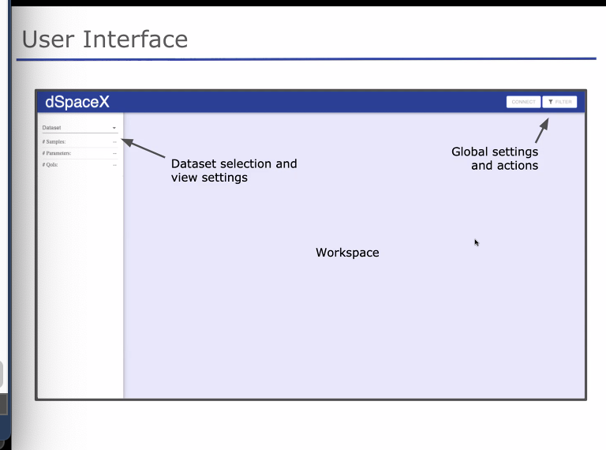
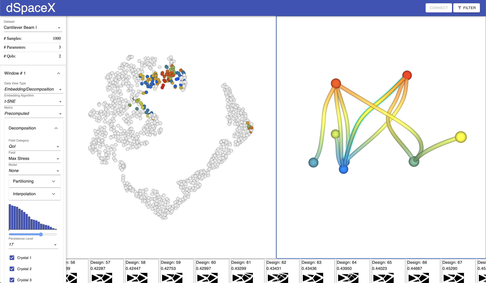
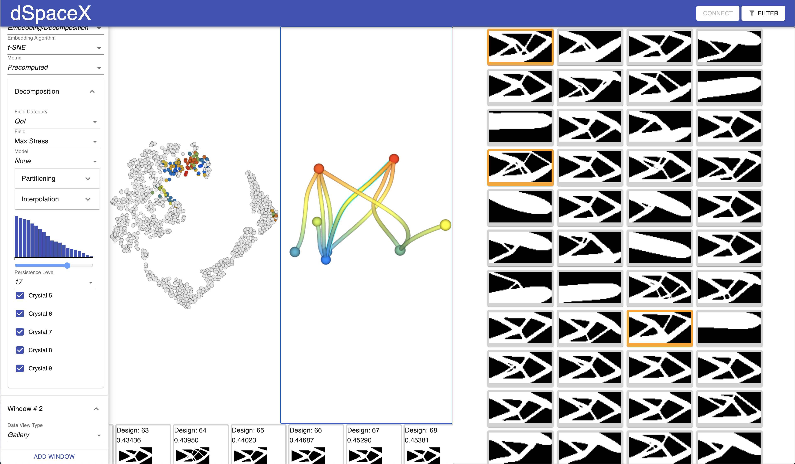

# Using dSpaceX
Once the has been preprocessed it can now be explored using the online GUI.

- [Overview](#overview)  
- [Embedding/Decomposition](#embedding-decomposition)  
- [Gallery](#gallery)  
- [Scatter plot](#scatter-plot)  
- [Table](#table)  

## Overview

Here is an overview of the Design Space Explorere GUI...

## Workspace windows
The windows avaialble enable exloration of the data in a variety of forms, all
of which are connected with respect to selection and filtering of the data. This
section describes each of the windows for **dSpaceX**.

### Embedding/Decomposition

### Gallery

### Scatter plot

### Table
